# Overview 组件总览

FunPlus 提供的相对丰富，功能简单且够用的组件。

## basic 基础组件
<Row :gutter="20">
  <Col :span="3">
    <Card title="Layout">
      
    </Card>
  </Col>
  <Col :span="3">
    <Card title="Grid">
      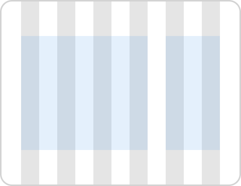
    </Card>
  </Col>
  <Col :span="3">
    <Card title="Icon">
      
    </Card>
  </Col>
  <Col :span="3">
    <Card title="Button">
      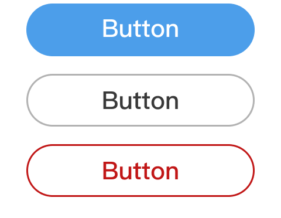
    </Card>
  </Col>
</Row>

## navigation 导航
<Row :gutter="20">
  <Col :span="3">
    <Card title="Breadcrumb">
      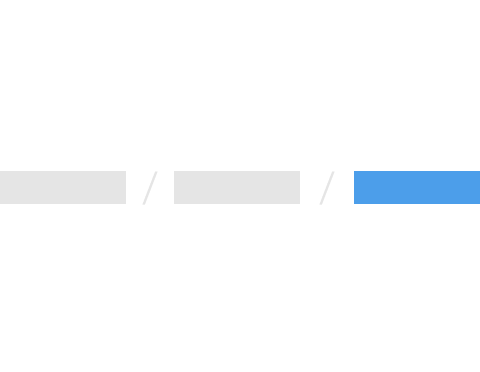
    </Card>
  </Col>
  <Col :span="3">
    <Card title="Stepper">
      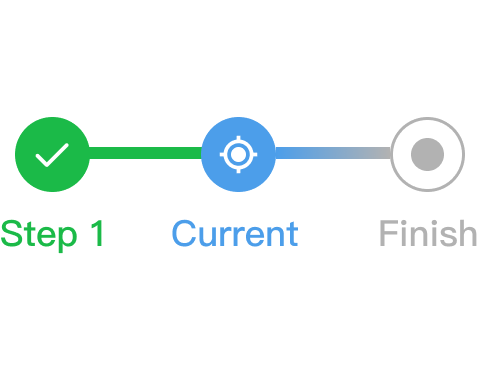
    </Card>
  </Col>
  <Col :span="3">
    <Card title="BackTop">
      
    </Card>
  </Col>
  <Col :span="3">
  </Col>
</Row>

## form 表单
<Row :gutter="20">
  <Col :span="3">
    <Card title="Form">
      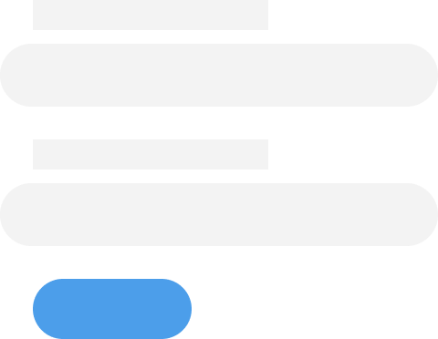
    </Card>
  </Col>
  <Col :span="3">
    <Card title="Input">
      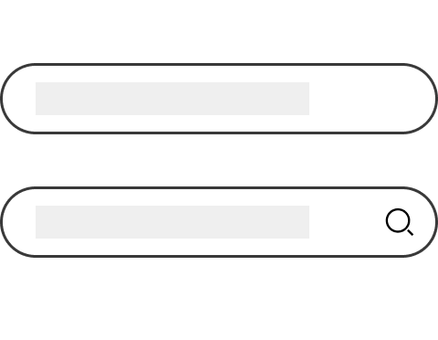
    </Card>
  </Col>
  <Col :span="3">
    <Card title="TextArea">
      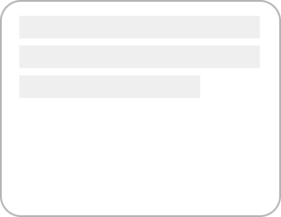
    </Card>
  </Col>
  <Col :span="3">
    <Card title="NumberInput">
      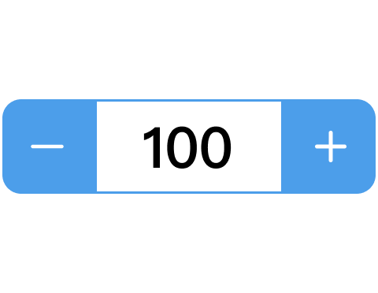
    </Card>
  </Col>
</Row>
<Row :gutter="20">
  <Col :span="3">
    <Card title="Radio">
      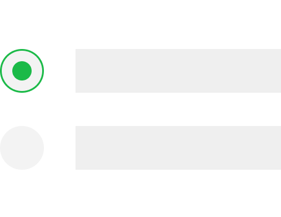
    </Card>
  </Col>
  <Col :span="3">
    <Card title="CheckBox">
      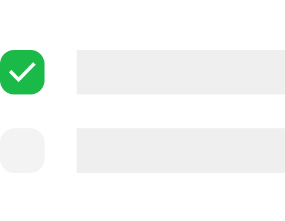
    </Card>
  </Col>
  <Col :span="3">
    <Card title="Select">
      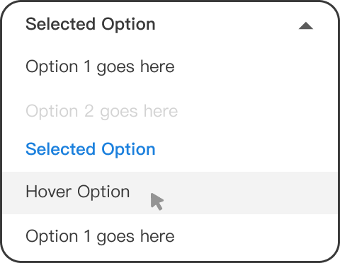
    </Card>
  </Col>
  <Col :span="3">
    <Card title="Switch">
      
    </Card>
  </Col>
</Row>

## data presentation 数据展示
<Row :gutter="20">
  <Col :span="3">
    <Card title="ToolTip">
      
    </Card>
  </Col>
  <Col :span="3">
    <Card title="Popover">
      
    </Card>
  </Col>
  <Col :span="3">
    <Card title="Skeleton">
      
    </Card>
  </Col>
  <Col :span="3">
    <!-- <Card title="Pagination">
      
    </Card> -->
  </Col>
</Row>

## feedback 反馈
<Row :gutter="20">
  <Col :span="3">
    <Card title="Alert">
      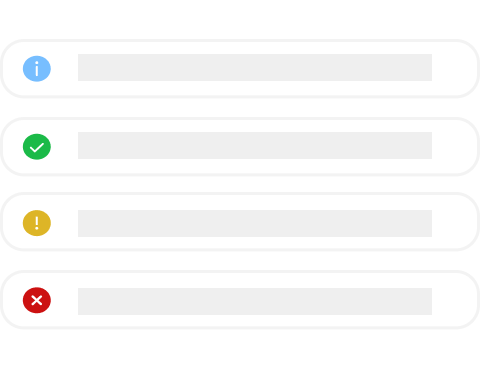
    </Card>
  </Col>
  <Col :span="3">
    <Card title="Notification">
      
    </Card>
  </Col>
  <Col :span="3">
    <Card title="Messsage">
      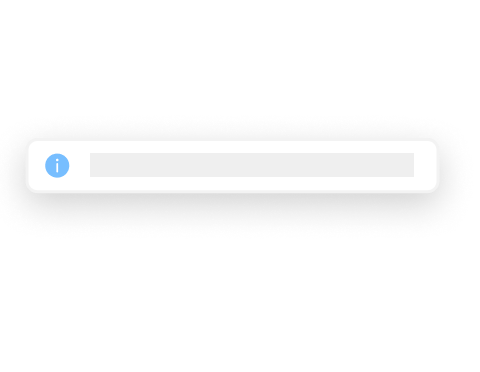
    </Card>
  </Col>
  <Col :span="3">
    <Card title="Toast">
      
    </Card>
  </Col>
</Row>
<!-- <Row :gutter="20">
  <Col :span="3">
    <Card title="Model">
      
    </Card>
  </Col>
  <Col :span="3">
    <Card title="Drawer">
      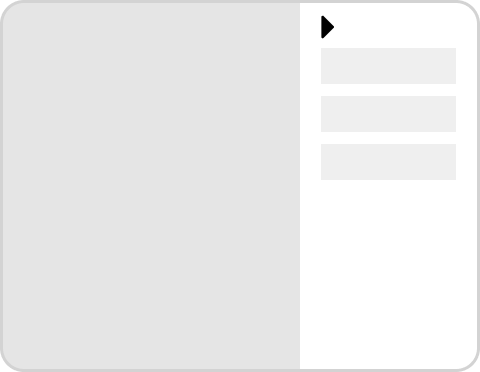
    </Card>
  </Col>
</Row> -->

## media 媒体
<Row :gutter="20">
  <Col :span="3">
    <Card title="Video">
      
    </Card>
  </Col>
  <Col :span="3">
    <Card title="Audio">
      
    </Card>
  </Col>
  <Col :span="3"></Col>
  <Col :span="3"></Col>
</Row>